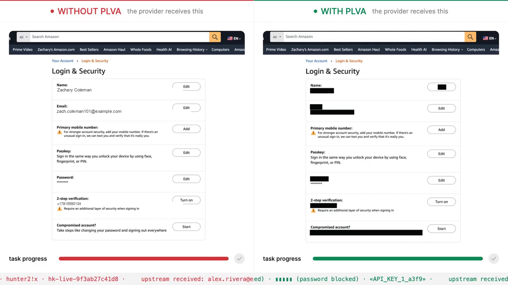
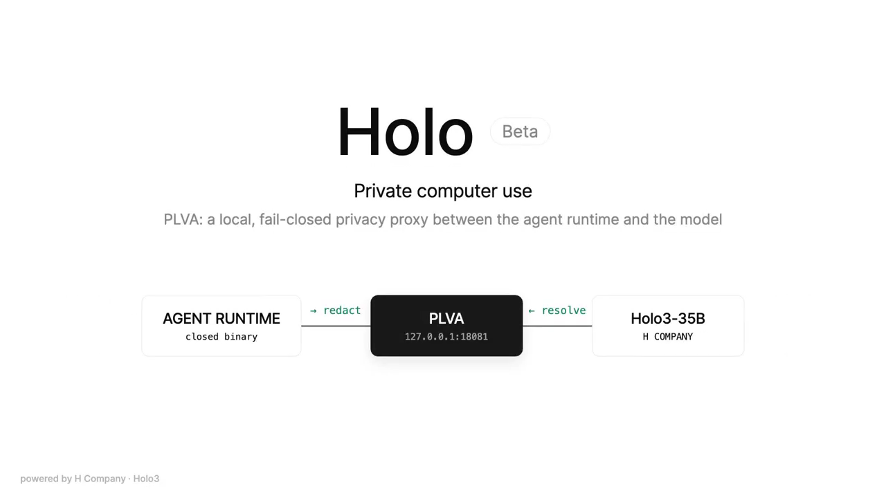
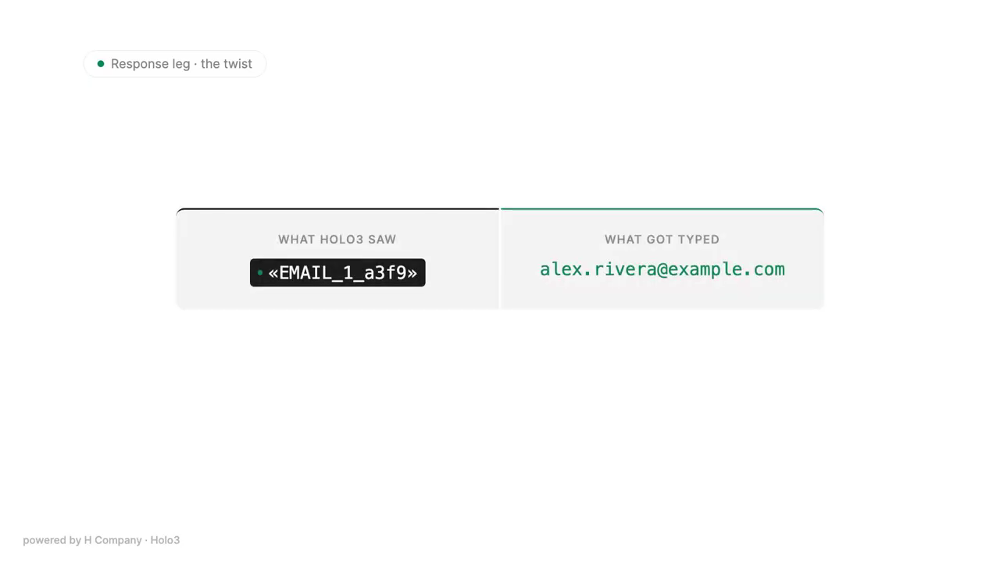
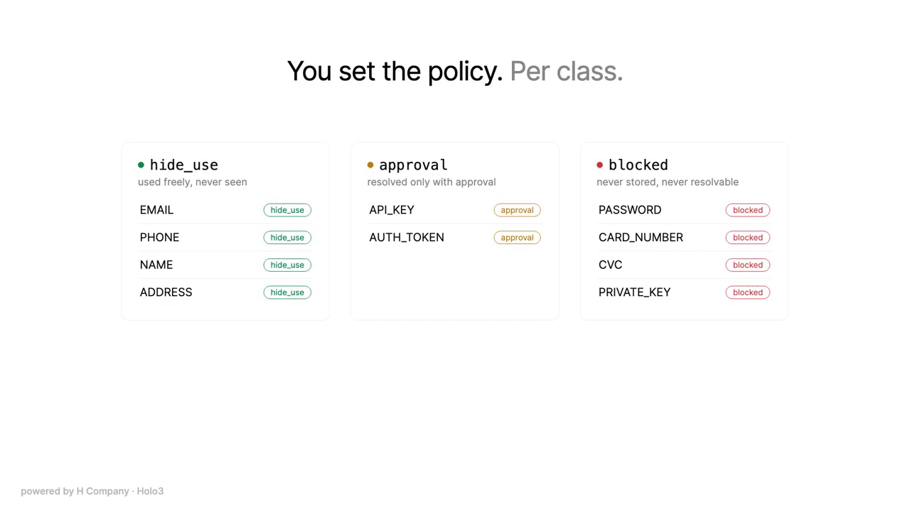
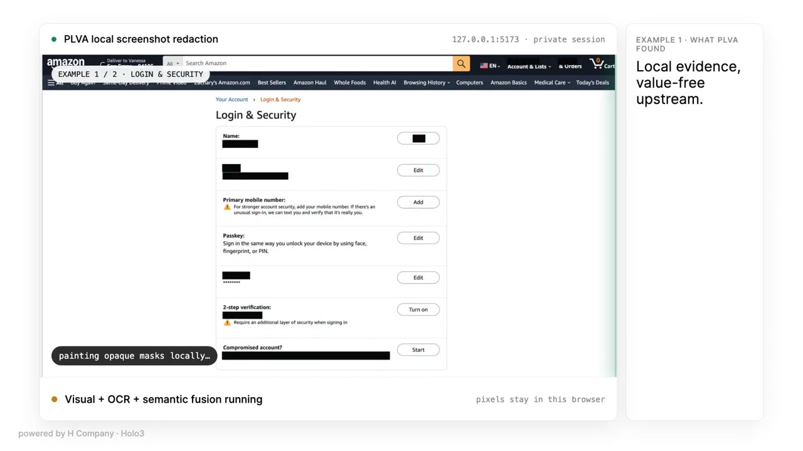

<div align="center">

# PLVA

**A local, fail-closed privacy proxy for computer-use agents.**

*Redact for the model. Not for the user.*

[Demo](media/demo.mp4) · [How it works](#what-happens-to-a-frame) · [Quickstart](#quickstart) · [Usage guide](docs/usage.md)

</div>

Computer-use agents see by screenshotting your entire screen, every step, and sending the raw pixels to a cloud model. Your inbox, your password manager, the card number on a checkout page: all of it ships upstream. PLVA sits between the agent runtime and the model provider, redacts every frame on your machine before it leaves, and restores the real values only inside the actions the agent executes locally. The task still completes. The provider never sees your data.

<a href="media/demo.mp4">
  
</a>
<p align="center"><sub>The same task, run twice. Only one of them leaked. Click through for the two-minute demo.</sub></p>

## The trick

The agent runtime is a closed binary. You cannot edit its perception loop, its action executor, or its prompts. It exposes exactly one useful knob: the base URL of its model provider.

PLVA becomes that URL.

```
base_url: "http://127.0.0.1:18081/v1"
```



No SDK, no agent patch, no provider cooperation. PLVA speaks the same OpenAI-compatible protocol on both sides and intercepts both directions of model traffic.

## What happens to a frame

Every screenshot crosses six stages before anything leaves the machine:

1. **Frame.** The proxy intercepts the screenshot the runtime just captured.
2. **Detect.** Apple Vision OCR, a Core ML visual detector, and deterministic secret rules find sensitive values on screen, entirely on device.
3. **Paint.** Opaque placeholder chips are painted over the real pixels. The model sees `«EMAIL_1_a3f9»`, never the address.
4. **Vault.** Real values go into a session-scoped, memory-only vault. No disk, no logs. Blocked classes such as passwords are never stored at all.
5. **Scrub.** Outbound conversation history is scrubbed twice: exact vault matches first, then a semantic classifier as a backstop.
6. **Ship.** The request leaves with a value-free token manifest that teaches the model which placeholders exist and what it may do with them.

The response leg is where it pays off. When the model answers with an action like `write(text="«EMAIL_1_a3f9»")`, PLVA resolves the token against the vault in transit. The runtime types the real value. The model never learns it.



## Fail closed

- If any stage fails, nothing is forwarded. There is no raw fallback.
- Placeholder tokens are bound to a session nonce. Forged or replayed tokens resolve to nothing.
- The proxy binds to loopback only. The vault is never persisted and never logged.
- With redaction enabled, a frame that cannot be redacted is a frame that does not leave.

## You set the policy

Every PII class carries a security level, configured in `config/privacy-policy.json`:

| Level | Behavior |
| --- | --- |
| `hide_use` | Redacted upstream, resolved freely in local actions |
| `approval` | Resolved only with a short-lived local approval bound to token, tool, argument path, TTL, and use count |
| `blocked` | Never vaulted, never resolvable |



## Audit it

Do not take the proxy's word for it. A memory-only viewer at `http://127.0.0.1:18081/viewer` keeps a ledger of the exact redacted pixels sent in each upstream request: frame number, SHA-256 prefix, mask count, redaction latency, and delivery status. Select any frame and inspect what actually crossed the boundary.


<p align="center"><sub>A live run against a real account page. Black rectangles are written into the exported image; zero raw pixels are uploaded.</sub></p>

## Quickstart

Requires macOS, Python 3.12+, and [uv](https://docs.astral.sh/uv/).

```bash
uv sync --group dev
./run_demo.sh
```

This opens the interactive playground at `http://127.0.0.1:18080`: a task box, the PLVA master toggle, the per-class policy editor, the redacted model view, and the vault.

Run a real agent task through the proxy with H Company's Holo3:

```bash
cp .env.example .env    # add HAI_API_KEY=<your key>

PLVA_PROVIDER=hcompany \
PLVA_REDACT=1 \
PLVA_REDACT_ENGINE=vision \
./run_agent.sh "Open Terminal, run: echo plva-ok, then report the output"
```

Measure the privacy delta with the deterministic, provider-free benchmark:

```bash
uv run plva-benchmark
```

It drives a synthetic account form through the full redaction, manifest, and resolution path and reports task completion, private-value exposures, and interception latency for PLVA off versus on.

Every mode and switch is documented in [docs/usage.md](docs/usage.md).

## Repository layout

| Path | Contents |
| --- | --- |
| `src/plva_proxy/` | The proxy: interception, privacy core, vault, policy, mediator, benchmark |
| `coreml-redactor/` | Apple Vision OCR and Core ML detection backend, the lowest-latency path on macOS |
| `redactor-worker/` | Persistent WebGPU/WASM redaction worker |
| `plvas-v3/` | Detector model engineering: training pipeline, browser playground, evaluation lab |
| `plva-v3-new/` | Standalone screenshot-to-redacted-PNG harness with integrity manifests |
| `holo-skills/` | Native Holo skills that teach the model the placeholder scheme |
| `config/` | Privacy policy and mediator configuration |
| `docs/` | Usage guide, egress hardening, local LLM runbook |
| `tests/` | Test suite (strict mypy, ruff, coverage gate at 80 percent) |
| `test-pages/` | Synthetic pages with fake PII for redaction testing |
| `media/` | Demo video and stills |

## Acknowledgments

Built at The Computer Use Hackathon. Powered by H Company's Holo3-35B. On-device detection runs on Apple Vision and Core ML.
